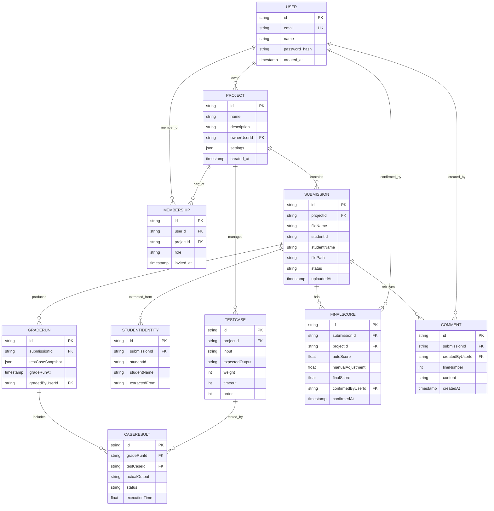
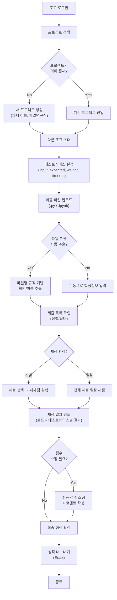

# Next.js 자동채점 플랫폼 | 완성형 정보구조 설계 (IA)

---

## 1. 최종 서비스 범위 정의

### In-Scope (포함)

- **다중 조교 협업 플랫폼**: 여러 조교가 로그인하여 과제 채점 작업 수행
- **프로젝트 단위 관리**: 각 과제(프로젝트)별로 테스트케이스, 조교 초대, 제출 관리
- **자동 채점 엔진**: Python .py/.ipynb 파일 실행 및 stdout 기반 채점
- **결과 검토 및 확정**: 자동 채점 후 수동 수정, 코멘트, 최종 성적 확정
- **성적 데이터 내보내기**: Excel 형식으로 결과 추출
- **조교 권한 관리**: 프로젝트별 초대 및 권한 부여

---

## 2. 완성형 IA 사이트맵

### 2.1 페이지 계층 트리 (URL 포함)

```
자동 채점 플랫폼
├── /auth
│   ├── /login                         # 로그인 페이지
│   └── /signup                        # 회원가입 페이지
│
├── /dashboard
│   └── /                              # 조교 대시보드 (프로젝트 목록)
│
├── /projects/[projectId]
│   ├── /                              # 프로젝트(과목) 상세 (개요)
│   ├── /members                       # 조교 초대/권한 관리
│   │
│   ├── /submissions                   # 제출 목록, 과제 페이지
│   │   ├── 일괄 채점 시작 버튼
│   │   ├── 업로드된 파일 리스트
│   │   ├── 필터 / 정렬
│   │   ├── 테스트케이스 설정
│   │   └── /[submissionId]
│   │       └── /                      # 제출 상세 (코드 + 테스트 케이스 + 채점 결과 readonly)
│   │
│   └── /settings                      # 프로젝트 기본 설정
│
└── /account
    └── /profile                      # 개인 계정 설정
```

---

## 3. 도메인 정보 구조 (객체 모델)

### 3.1 핵심 엔티티 및 속성

| 엔티티              | 설명                                | 핵심 속성                                                                                                                                   |
| ------------------- | ----------------------------------- | ------------------------------------------------------------------------------------------------------------------------------------------- |
| **User**            | 조교 계정                           | id, email, name, passwordHash, createdAt                                                                                                    |
| **Project**         | 하나의 과목/채점 프로젝트           | id, name, description, ownerUserId, createdAt                                                                                               |
| **Membership**      | 프로젝트별 조교 참여 관계           | id, projectId, userId, role, invitedAt, joinedAt                                                                                            |
| **ProjectSetting**  | 프로젝트 기본 설정                  | id, projectId, fileNameRule, createdAt, updatedAt                                                                                           |
| **Submission**      | 업로드된 제출 파일                  | id, projectId, fileName, fileType, filePath, uploadedAt, status(pending/graded), latestGradeRunId                                           |
| **StudentIdentity** | 제출 파일명에서 추출한 학생 정보    | id, submissionId, studentId, studentName, extractedByRule, isMatched                                                                        |
| **TestCase**        | 프로젝트 공통 테스트케이스          | id, projectId, input, expectedOutput, weight, timeout, order, createdAt, updatedAt                                                          |
| **GradeRun**        | 제출 건에 대한 채점 실행 기록       | id, submissionId, projectId, gradedByUserId, testCaseSnapshot, totalAutoScore, gradeRunAt                                                   |
| **CaseResult**      | 채점 실행 내 개별 테스트케이스 결과 | id, gradeRunId, testCaseId, inputSnapshot, expectedOutputSnapshot, actualOutput, status(passed/failed/runtime_error/timeout), executionTime |
| **ExportHistory**   | 성적 조회/내보내기 실행 이력        | id, projectId, exportedByUserId, exportType, createdAt                                                                                      |

### 3.3 엔티티 관계도 (Mermaid ER)



---

## 4. 핵심 플로우 다이어그램

### 4.1 조교 작업 플로우 (업로드 → 확정 → 내보내기)



**흐름 설명**: 조교는 프로젝트 생성 → 팀원 초대 → 테스트케이스 설정 → 파일 업로드 및 학생정보 추출 → 채점 실행 → 결과 검토 및 수정 → 최종 확정 → 내보내기의 순환 과정을 거칩니다.

---

## 5. 현재 구현 기능 vs 최종 기능 매핑표

| 기능명                        | 현재 상태 | 관련 페이지               | 관련 API                            | 관련 서버 모듈                     | 비고                     |
| ----------------------------- | --------- | ------------------------- | ----------------------------------- | ---------------------------------- | ------------------------ |
| **파일 업로드 (.py/.ipynb)**  | ✅ 완료   | /submissions              | POST /api/submissions               | SubmissionRepository               |                          |
| **.ipynb 코드 셀 추출**       | ✅ 완료   | /submissions              | POST /api/submissions               | NotebookConverter                  |                          |
| **테스트케이스 관리**         | ✅ 완료   | /projects/[id]/settings   | PATCH /api/projects/[id]            | ProjectRepository                  |                          |
| **Python 실행 + 채점**        | ✅ 완료   | /submissions/[id]         | POST /api/grade                     | GradingEngine                      |                          |
| **일괄 채점**                 | ✅ 완료   | /batch-grade              | POST /api/grade/batch               | GradingEngine                      |                          |
| **제출 상세 보기**            | ✅ 완료   | /submissions/[id]         | GET /api/submissions/[id]           | SubmissionRepository               |                          |
| **파일 다운로드/삭제**        | ✅ 완료   | /submissions              | DELETE /api/submissions             | SubmissionRepository               |                          |
| **로그인/회원가입**           | ⬜ 미구현 | /auth/login, /auth/signup | POST /api/auth/login, signup        | AuthService                        | JWT 또는 세션 선택 필요  |
| **프로젝트 생성/관리**        | ⬜ 미구현 | /projects, /projects/[id] | POST/GET/PATCH /api/projects        | ProjectRepository                  | 다중 조교 협업의 기초    |
| **조교 초대/권한**            | ⬜ 미구현 | /projects/[id]/members    | POST /api/projects/[id]/members     | MembershipService                  | Membership 테이블 필수   |
| **파일명 규칙 검증**          | ⬜ 미구현 | /projects/[id]/settings   | PATCH /api/projects/[id]            | ProjectRepository                  | 정규식 기반              |
| **파일명 기반 학생정보 추출** | ⬜ 미구현 | /submissions              | POST /api/submissions               | StudentIdentityExtractor           | 파일명 규칙 선행 필수    |
| **파일 정렬/필터/순서 변경**  | ⬜ 미구현 | /submissions              | GET /api/submissions (쿼리 확장)    | SubmissionRepository               | 클라이언트 또는 API 정렬 |
| **점수 수동 수정**            | ⬜ 미구현 | /submissions/[id]/score   | PATCH /api/submissions/[id]/score   | ScoreCalculator, FinalScore 테이블 | 감사 로그 권장           |
| **코멘트 기능**               | ⬜ 미구현 | /submissions/[id]         | POST /api/submissions/[id]/comments | Comment 테이블                     | 라인번호 기반 추천       |
| **Excel 내보내기**            | ⬜ 미구현 | /reports/scores           | GET /api/reports/scores (Excel)     | ExcelExporter                      | xlsx 라이브러리          |
| **대시보드**                  | ⬜ 미구현 | /dashboard                | GET /api/projects                   | ProjectRepository                  | 조교의 프로젝트 목록     |

---

## 6. 기능 요약

### 완성형 조교 채점 플랫폼 | 핵심 기능 8개 항목

**서비스 범위**: 조교 여러 명이 로그인하여 파이썬 과제를 협업으로 자동 채점하고 결과를 관리하는 내부 플랫폼

#### 🎯 핵심 기능 구성

1. **다중 조교 협업**
   - 조교 로그인/회원가입 → 프로젝트 생성 → 팀원 초대 (owner/editor/viewer 역할)
   - 각 프로젝트별로 독립적인 테스트케이스 및 제출 관리

2. **프로젝트 단위 관리**
   - 과제별 프로젝트 생성, 파일명 규칙 설정, 테스트케이스 정의
   - 프로젝트 설정 페이지에서 일괄 관리

3. **자동 학생정보 추출**
   - 파일명 규칙(정규식) 기반 자동 파싱 → 학번/이름 추출
   - 추출 실패 시 수동 입력 가능

4. **Python 자동 채점 엔진** (현재 구현)
   - .py/.ipynb 업로드 → .ipynb는 JSON 파싱 후 code cell 추출
   - 각 테스트케이스를 Node subprocess에서 실행 → stdout 비교 채점
   - 상태 판정: passed / failed / runtime_error / timeout

5. **개별 & 일괄 채점**
   - 제출 상세 페이지에서 재채점 가능
   - 대량 제출 시 일괄 채점 페이지에서 한 번에 실행
   - 테스트케이스별 가중치 기반 자동 점수 계산

6. **결과 검토 및 수정**
   - 제출별 코드(readonly) + 테스트케이스별 통과/실패 표시
   - 점수 수동 조정 가능
   - 라인별 코멘트 작성 기능 (피드백)

7. **성적 확정 및 내보내기**
   - 자동 점수 + 수동 조정 = 최종 성적
   - 최종 성적 확정 시 조교명 및 확정 시간 기록
   - Excel 형식으로 일괄 내보내기

8. **제출 파일 관리**
   - 업로드 목록에서 학생정보/상태/점수 기준 정렬/필터
   - 파일 다운로드, 선택 삭제
   - 업로드 시간 및 재채점 이력 추적

---

## 7. API 엔드포인트 전체 명세 (참고)

### 인증

- `POST /api/auth/login` - 로그인
- `POST /api/auth/signup` - 회원가입
- `POST /api/auth/logout` - 로그아웃

### 프로젝트

- `GET /api/projects` - 내 프로젝트 목록
- `POST /api/projects` - 프로젝트 생성
- `GET /api/projects/[id]` - 프로젝트 상세
- `PATCH /api/projects/[id]` - 프로젝트 수정 (테스트케이스 포함)
- `DELETE /api/projects/[id]` - 프로젝트 삭제

### 조교 초대 및 권한

- `POST /api/projects/[id]/members` - 조교 초대
- `GET /api/projects/[id]/members` - 조교 목록
- `PATCH /api/projects/[id]/members/[memberId]` - 권한 수정
- `DELETE /api/projects/[id]/members/[memberId]` - 조교 제거

### 제출 파일

- `GET /api/projects/[id]/submissions` - 제출 목록 (필터/정렬)
- `POST /api/projects/[id]/submissions` - 파일 업로드
- `GET /api/projects/[id]/submissions/[submissionId]` - 제출 상세
- `PATCH /api/projects/[id]/submissions/[submissionId]` - 학생정보 수정
- `DELETE /api/projects/[id]/submissions/[submissionId]` - 제출 삭제
- `GET /api/projects/[id]/submissions/[submissionId]/download` - 파일 다운로드

### 채점

- `POST /api/projects/[id]/grade` - 단일 제출 채점
- `POST /api/projects/[id]/grade/batch` - 일괄 채점
- `GET /api/projects/[id]/submissions/[submissionId]/gradehistory` - 채점 이력

### 성적

- `PATCH /api/projects/[id]/submissions/[submissionId]/score` - 최종 성적 수정
- `PATCH /api/projects/[id]/submissions/[submissionId]/confirm` - 최종 성적 확정
- `GET /api/projects/[id]/reports/scores` - 성적 조회/내보내기

### 코멘트(댓글)

- `POST /api/projects/[id]/submissions/[submissionId]/comments` - 코멘트 추가
- `GET /api/projects/[id]/submissions/[submissionId]/comments` - 코멘트 조회
- `DELETE /api/projects/[id]/submissions/[submissionId]/comments/[commentId]` - 코멘트 삭제
