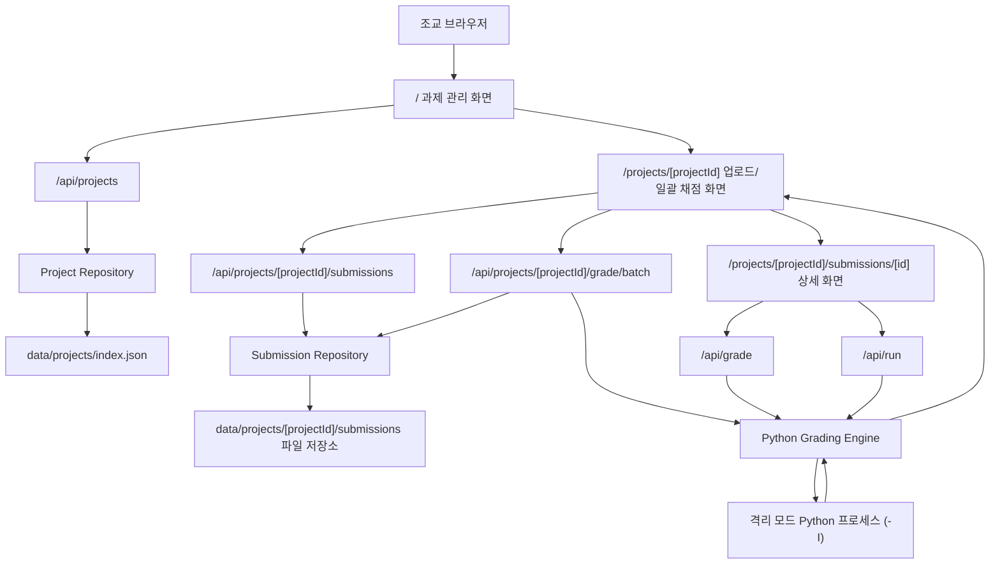
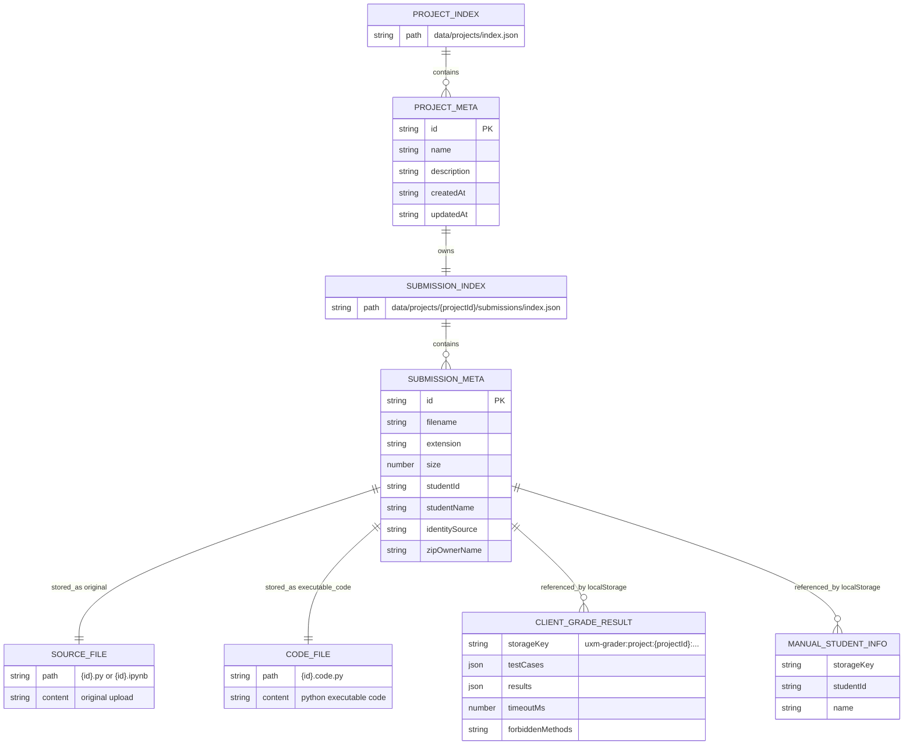
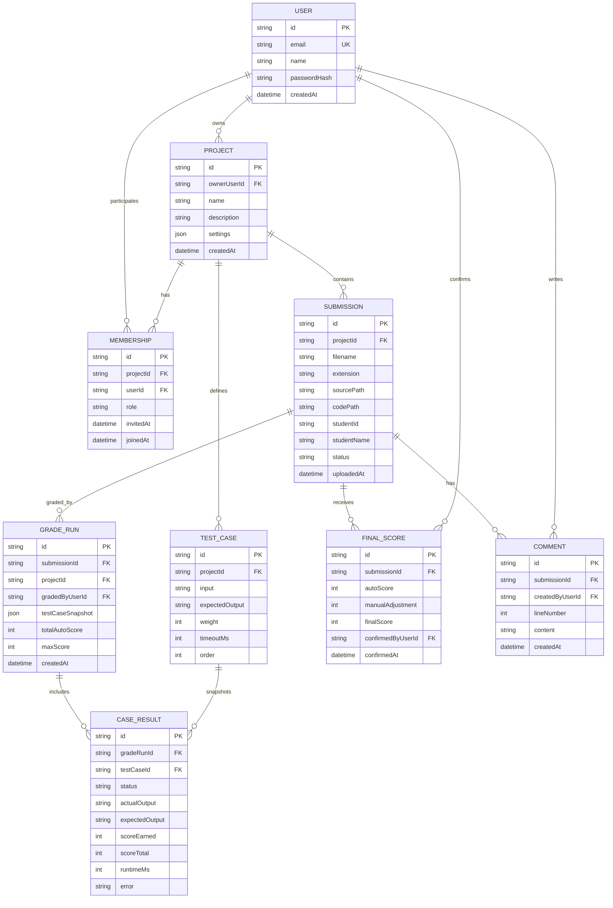
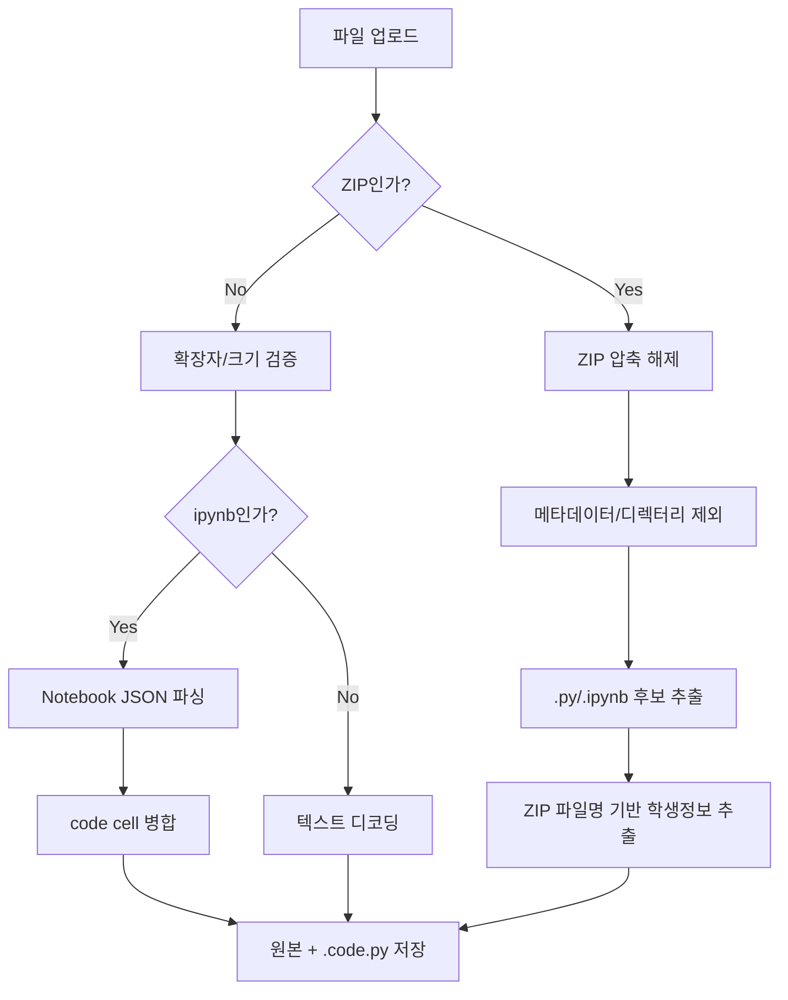

# UXM Python Auto Grader

Python 과제 제출 파일을 업로드하고, 공통 테스트케이스로 자동 실행/채점하는 Next.js 기반 내부 도구입니다. 현재 구현은 과제(프로젝트)별로 제출 파일과 채점 설정을 분리해 관리하며, 향후 다중 조교 협업 플랫폼으로 확장할 수 있도록 프로젝트 관리, 제출 관리, 채점 엔진, UI 컴포넌트가 기능별로 분리되어 있습니다.

> 이 문서는 다음 담당자가 프로젝트의 현재 상태를 빠르게 파악하고, 안전하게 유지보수 및 확장할 수 있도록 작성된 인수인계 문서입니다.

---

## 1. 한눈에 보는 프로젝트

| 항목 | 내용 |
| --- | --- |
| 제품 목적 | Python `.py`, Jupyter Notebook `.ipynb`, ZIP 제출물을 업로드하고 테스트케이스 기반으로 자동 채점 |
| 주요 사용자 | 수업 조교, 운영자, 과제 채점 담당자 |
| 현재 앱 구조 | Next.js App Router + React Client Components + 파일 시스템 기반 저장소 |
| 프론트엔드 | React 19, Next.js 16, Tailwind CSS 4 |
| 백엔드 | Next Route Handlers, Node.js `child_process.spawn`, 로컬 파일 저장 |
| 채점 대상 | Python 코드 표준 입력/표준 출력 문제 |
| 데이터 저장 | `data/projects/index.json` + `data/projects/{projectId}/submissions` |
| 인증/권한 | 미구현 |
| DB | 미구현 |
| 테스트 코드 | 현재 없음 |

---

## 2. 핵심 사용자 시나리오

1. 조교가 메인 페이지(`/`)에서 과제를 생성하거나 기존 과제를 선택합니다.
2. 과제 상세(`/projects/[projectId]`)에서 `.py`, `.ipynb`, `.zip` 파일을 업로드합니다.
3. 서버가 제출 파일을 검증하고 `data/projects/{projectId}/submissions` 아래에 원본과 채점용 Python 코드를 저장합니다.
4. 파일명 또는 ZIP 파일명에서 학번/이름을 자동 추출합니다. 실패하면 UI에서 수동 입력할 수 있습니다.
5. 조교가 공통 테스트케이스, 배점, 제한 시간, 금지 메소드를 설정합니다.
6. “채점 시작”을 누르면 해당 과제의 전체 제출물을 순차 실행하고 결과를 화면에 표시합니다.
7. 특정 제출물을 클릭하면 `/projects/[projectId]/submissions/[id]` 상세 화면에서 코드, Notebook 셀, 개별 테스트케이스 결과를 확인할 수 있습니다.
8. `.ipynb` 제출물은 code cell 단위 편집/실행, 셀 병합, 원본 복원이 가능합니다.
9. 선택한 제출 파일은 다운로드 또는 삭제할 수 있고, 상위 페이지에서 과제 자체도 삭제할 수 있습니다.

---

## 3. 현재 구현 범위

### 3.1 완료된 기능

| 기능 | 구현 상태 | 관련 경로 |
| --- | --- | --- |
| 과제 생성/목록/삭제 | 완료 | `GET/POST /api/projects`, `DELETE /api/projects/[projectId]` |
| 단일/다중 파일 업로드 | 완료 | `POST /api/projects/[projectId]/submissions` |
| ZIP 업로드 및 내부 `.py`/`.ipynb` 추출 | 완료 | `createSubmissionsFromUpload` |
| `.ipynb` code cell 추출 및 Python 코드 병합 | 완료 | `notebookToPython`, `extractNotebookCodeCells` |
| 제출 목록 조회 | 완료 | `GET /api/projects/[projectId]/submissions` |
| 제출 상세 조회 | 완료 | `GET /api/projects/[projectId]/submissions/[id]` |
| 제출 원본 다운로드 | 완료 | `GET /api/projects/[projectId]/submissions/[id]/download` |
| 선택 제출 삭제 | 완료 | `DELETE /api/projects/[projectId]/submissions` |
| 단일 코드 실행 | 완료 | `POST /api/run` |
| 단일 제출 채점 | 완료 | `POST /api/grade` |
| 전체 제출 일괄 채점 | 완료 | `POST /api/projects/[projectId]/grade/batch` |
| 테스트케이스 편집 | 완료 | `TestCaseEditor` |
| 제한 시간 설정 | 완료 | `boundedTimeout` |
| 금지 메소드 정적 탐지 | 완료 | Python AST 기반 스캔 |
| 한글 파일명 깨짐 보정 | 완료 | `repairFilenameMojibake` |
| 브라우저 로컬 저장 | 완료 | `useStoredState` |

### 3.2 미구현/기획 단계 기능

| 기능 | 필요성 | 권장 구현 |
| --- | --- | --- |
| 로그인/회원가입 | 조교별 접근 제어 | NextAuth/Auth.js 또는 자체 세션 |
| 프로젝트 설정 고도화 | 테스트케이스/파일명 규칙 등 과제 설정 관리 | `ProjectSetting` DB 모델 도입 |
| 조교 초대/권한 | 협업 및 감사 추적 | `Membership` 모델과 RBAC |
| 영구 채점 이력 | 결과 재현성 확보 | `GradeRun`, `CaseResult` 저장 |
| 최종 점수 확정/수동 조정 | 실제 성적 산출 | `FinalScore`, 감사 로그 |
| 코멘트/피드백 | 학생 피드백 관리 | `Comment` 모델 |
| Excel/CSV 내보내기 | 성적 제출 업무 | `xlsx` 또는 CSV exporter |
| 서버 사이드 정렬/필터 | 제출 규모 증가 대응 | API query + DB index |
| 안전한 코드 샌드박스 | 임의 Python 실행 위험 완화 | Docker/firejail/nsjail/격리 워커 |

---

## 4. 기술 스택 및 실행 환경

### 4.1 주요 의존성

| 패키지 | 버전 | 용도 |
| --- | --- | --- |
| `next` | `16.2.1` | App Router 기반 웹 앱/API |
| `react`, `react-dom` | `19.2.4` | UI |
| `tailwindcss` | `^4` | 스타일링 |
| `fflate` | `^0.8.3` | ZIP 압축 해제 |
| `typescript` | `^5` | 정적 타입 |
| `eslint` | `^9` | 린팅 |

### 4.2 로컬 실행

```bash
pnpm install
pnpm dev
```

브라우저에서 `http://localhost:3000`으로 접속합니다.

### 4.3 운영/빌드

```bash
pnpm build
pnpm start
pnpm lint
```

### 4.4 시스템 요구사항

- Node.js: Next.js 16 및 React 19를 지원하는 버전
- Python: 서버에서 `python`, `python3`, `py` 중 하나가 실행 가능해야 함
- 파일 쓰기 권한: 프로젝트 루트의 `data/projects` 디렉터리에 읽기/쓰기 가능해야 함

---

## 5. 디렉터리 구조

```text
.
├── src
│   ├── app
│   │   ├── api
│   │   │   ├── grade
│   │   │   │   ├── route.ts
│   │   │   │   └── batch/route.ts
│   │   │   ├── run/route.ts
│   │   │   ├── projects
│   │   │   │   ├── route.ts
│   │   │   │   └── [projectId]
│   │   │   │       ├── route.ts
│   │   │   │       ├── grade/batch/route.ts
│   │   │   │       └── submissions/...
│   │   │   └── submissions
│   │   │       ├── route.ts
│   │   │       └── [id]
│   │   │           ├── route.ts
│   │   │           └── download/route.ts
│   │   ├── page.tsx
│   │   ├── projects/[projectId]/page.tsx
│   │   ├── projects/[projectId]/submissions/[id]/page.tsx
│   │   ├── submissions/[id]/page.tsx
│   │   ├── layout.tsx
│   │   └── globals.css
│   ├── features
│   │   ├── projects
│   │   │   ├── components/ProjectsDashboard.tsx
│   │   │   └── server/projects-repository.ts
│   │   ├── grading
│   │   │   ├── components
│   │   │   │   ├── GraderWorkspace.tsx
│   │   │   │   └── TestCaseEditor.tsx
│   │   │   ├── lib/forbidden-methods.ts
│   │   │   └── server/python-grading-engine.ts
│   │   └── submissions
│   │       ├── components/SubmissionUploadList.tsx
│   │       └── server/submissions-repository.ts
│   └── lib
│       ├── repair-filename.ts
│       ├── use-stored-state.ts
│       ├── grader.ts
│       └── submissions-store.ts
├── data/projects
│   └── index.json
├── data/submissions
│   └── index.json
├── package.json
├── next.config.ts
├── tsconfig.json
└── README.md
```

---

## 6. 아키텍처

### 6.1 요청 흐름



### 6.2 레이어 책임

| 레이어 | 책임 | 주요 파일 |
| --- | --- | --- |
| Page/UI | 사용자 입력, 화면 상태, 결과 표시 | `page.tsx`, `ProjectsDashboard.tsx`, `SubmissionUploadList.tsx`, `GraderWorkspace.tsx` |
| API Route | 요청 검증, 서버 기능 호출, JSON 응답 | `src/app/api/**/route.ts` |
| Project Repository | 과제 생성/목록/삭제, 제출 수 집계 | `projects-repository.ts` |
| Repository | 제출 파일 저장/조회/삭제, ZIP/Notebook 변환 | `submissions-repository.ts` |
| Grading Engine | Python 실행, 출력 비교, 금지 메소드 검사, 점수 계산 | `python-grading-engine.ts` |
| Client Storage | 테스트케이스/채점 결과 임시 저장 | `use-stored-state.ts` |

---

## 7. 데이터 저장 구조

현재는 데이터베이스가 없고 파일 시스템을 사용합니다. 기존 전역 제출 저장소(`data/submissions`)는 하위 호환용으로 남아 있고, 새 화면은 과제별 저장소를 사용합니다.

### 7.1 저장 위치

```text
data/projects/
├── index.json
└── {projectId}/
    └── submissions/
        ├── index.json
        ├── {submissionId}.py
        ├── {submissionId}.ipynb
        └── {submissionId}.code.py
```

### 7.2 `index.json`

`data/projects/index.json`은 과제 메타데이터 배열을 저장합니다. 각 과제의 `submissions/index.json`은 제출물 메타데이터 배열을 저장합니다.

```ts
type ProjectIndex = {
  items: ProjectMeta[];
};

type ProjectMeta = {
  id: string;
  name: string;
  description?: string;
  createdAt: string;
  updatedAt: string;
};
```

```ts
type SubmissionIndex = {
  items: SubmissionMeta[];
};

type SubmissionMeta = {
  id: string;
  filename: string;
  extension: ".py" | ".ipynb";
  size: number;
  studentId?: string;
  studentName?: string;
  identitySource?: "zip" | "filename";
  zipOwnerName?: string;
};
```

### 7.3 제출 파일 저장 방식

| 파일 | 설명 |
| --- | --- |
| `{id}.py` | `.py` 원본 업로드 파일 |
| `{id}.ipynb` | `.ipynb` 원본 Notebook JSON |
| `{id}.code.py` | 채점에 사용할 Python 코드. `.ipynb`는 code cell만 병합 |

### 7.4 브라우저 localStorage

다음 값은 서버가 아니라 브라우저에 저장됩니다.

| Key 패턴 | 내용 |
| --- | --- |
| `uxm-grader:project:{projectId}:test-cases` | 과제별 일괄 채점 테스트케이스 |
| `uxm-grader:project:{projectId}:timeout-ms` | 과제별 일괄 채점 제한 시간 |
| `uxm-grader:project:{projectId}:forbidden-methods` | 과제별 일괄 채점 금지 메소드 |
| `uxm-grader:project:{projectId}:result` | 과제별 일괄 채점 결과 |
| `uxm-grader:project:{projectId}:submission:{submissionId}:*` | 과제/제출 상세별 테스트케이스, 결과, 셀 입력값 |
| `uxm-grader:project:{projectId}:manual-student-info` | 과제별 자동 추출 실패 수동 학번/이름 |

주의: 채점 결과와 수동 학생 정보는 영구 서버 데이터가 아니므로, 브라우저/사용자/기기별로 달라질 수 있습니다.

---

## 8. 현재 데이터 모델 ERD

현재 구현은 DB 기반 ERD가 아니라 파일 저장소와 클라이언트 상태를 조합합니다.



---

## 9. 향후 목표 ERD

협업형 채점 플랫폼으로 확장할 경우 권장되는 영구 데이터 모델입니다.



---

## 10. API 명세

### 10.1 과제 관리

#### `GET /api/projects`

과제 목록을 최신 수정순으로 반환합니다. 각 항목에는 제출 파일 수가 포함됩니다.

#### `POST /api/projects`

과제를 생성합니다.

요청:

```json
{
  "name": "Python 기초 과제 1",
  "description": "조건문/반복문 연습"
}
```

#### `GET /api/projects/[projectId]`

과제 단건을 조회합니다.

#### `DELETE /api/projects/[projectId]`

과제를 삭제합니다. 해당 과제의 제출 파일 저장소도 함께 삭제됩니다.

### 10.2 제출 관리

#### `GET /api/projects/[projectId]/submissions`

업로드된 제출 목록을 최신순으로 반환합니다.

응답:

```json
{
  "ok": true,
  "items": [
    {
      "id": "uuid",
      "filename": "answer.py",
      "extension": ".py",
      "size": 1234
    }
  ]
}
```

#### `POST /api/projects/[projectId]/submissions`

`multipart/form-data`의 `files` 필드로 `.py`, `.ipynb`, `.zip` 파일을 업로드합니다.

제약:

- 단일 `.py`/`.ipynb`: 최대 2MB
- `.zip`: 최대 50MB
- ZIP 내부 제출 파일: 최대 500개
- ZIP 내부 개별 제출 파일: 최대 2MB

응답:

```json
{
  "ok": true,
  "created": [],
  "skipped": []
}
```

#### `DELETE /api/projects/[projectId]/submissions`

선택한 제출물을 삭제합니다.

요청:

```json
{
  "ids": ["submission-id"]
}
```

#### `GET /api/projects/[projectId]/submissions/[id]`

제출 상세와 채점용 코드를 반환합니다. `.ipynb`는 `notebookCells`도 함께 반환합니다.

#### `GET /api/projects/[projectId]/submissions/[id]/download`

원본 제출 파일을 다운로드합니다.

하위 호환용 전역 제출 API(`/api/submissions`, `/api/submissions/[id]`)도 남아 있지만, 신규 화면은 과제별 API만 사용합니다.

### 10.3 코드 실행/채점

#### `POST /api/run`

Python 코드를 한 번 실행합니다. Notebook 셀 실행에 사용됩니다.

요청:

```json
{
  "code": "print(input())",
  "stdin": "hello",
  "timeoutMs": 2000,
  "forbiddenMethods": ["sorted", "list.sort"]
}
```

응답:

```json
{
  "ok": true,
  "pythonCommand": "python3",
  "stdout": "hello",
  "stderr": "",
  "status": "ok",
  "runtimeMs": 32
}
```

#### `POST /api/grade`

하나의 코드 문자열을 여러 테스트케이스로 채점합니다.

요청:

```json
{
  "code": "a=int(input())\nprint(a+1)",
  "testCases": [
    {
      "input": "1",
      "expectedOutput": "2",
      "weight": 10
    }
  ],
  "timeoutMs": 2000,
  "forbiddenMethods": []
}
```

응답:

```json
{
  "ok": true,
  "pythonCommand": "python3",
  "summary": {
    "totalScore": 10,
    "maxScore": 10,
    "passedCount": 1,
    "totalCount": 1,
    "allPassed": true,
    "accepted": true
  },
  "results": []
}
```

#### `POST /api/projects/[projectId]/grade/batch`

특정 과제에 저장된 모든 제출물을 같은 테스트케이스로 순차 채점합니다.

요청:

```json
{
  "testCases": [
    {
      "input": "1",
      "expectedOutput": "2",
      "weight": 10
    }
  ],
  "timeoutMs": 2000,
  "forbiddenMethods": []
}
```

---

## 11. 채점 엔진 상세

핵심 파일: `src/features/grading/server/python-grading-engine.ts`

### 11.1 실행 방식

1. 서버가 `python`, `python3`, `py` 순서로 실행 가능한 Python 명령을 탐색합니다.
2. 제출 코드를 임시 디렉터리의 `student.py`로 저장합니다.
3. 각 테스트케이스마다 `python -I student.py`를 별도 프로세스로 실행합니다.
4. 테스트케이스 입력값은 stdin으로 전달합니다.
5. stdout/stderr/runtime/status를 수집합니다.
6. 임시 디렉터리를 삭제합니다.

`-I` 옵션은 Python isolated mode를 활성화하지만, OS 수준 샌드박스는 아닙니다. 신뢰할 수 없는 코드를 실행하는 서비스라면 반드시 추가 격리가 필요합니다.

### 11.2 제한값

| 상수 | 값 | 의미 |
| --- | --- | --- |
| `MAX_CODE_SIZE` | 50,000 | API에서 받는 코드 최대 길이 |
| `MAX_TEST_CASES` | 30 | 테스트케이스 최대 개수 |
| `DEFAULT_TIMEOUT_MS` | 2,000 | 기본 제한 시간 |
| `MIN_TIMEOUT_MS` | 100 | 최소 제한 시간 |
| `MAX_TIMEOUT_MS` | 20,000 | 최대 제한 시간 |
| `MAX_FORBIDDEN_METHODS` | 50 | 금지 메소드 최대 개수 |
| `MAX_FORBIDDEN_METHOD_LENGTH` | 80 | 금지 메소드 문자열 최대 길이 |

### 11.3 출력 비교 정책

정답 비교는 완전 엄격 비교가 아니라 다음 순서의 완화 비교를 사용합니다.

1. 줄 끝 공백 제거, 전체 trim, 연속 공백 단일화 후 비교
2. 기대 출력의 모든 토큰이 실제 출력에 포함되는지 확인
3. 기대 출력과 실제 출력에서 숫자 시퀀스를 추출해 `1e-9` 오차로 비교

장점:

- `input()` 프롬프트, 공백, 줄바꿈 차이로 인한 불필요한 오답을 줄입니다.
- 숫자 출력 문제에서 형식 차이에 어느 정도 견딥니다.

주의:

- 토큰 부분집합 비교 때문에 의도보다 관대하게 정답 처리될 수 있습니다.
- 채점 기준이 엄격해야 하는 과제는 비교 정책을 과제별로 선택 가능하게 분리하는 것이 좋습니다.

### 11.4 점수 정책

현재 API는 `scorePolicy: "any"`를 사용합니다.

- 테스트케이스 중 하나라도 통과하면 전체 배점 합계를 부여합니다.
- 하나도 통과하지 못하면 0점입니다.

엔진 내부에는 `"partial"`, `"all"`, `"any"` 정책이 존재하지만 현재 라우트에서는 `"any"`로 고정되어 있습니다. 과제 유형에 따라 이 정책은 반드시 설정 가능하도록 확장하는 것이 좋습니다.

### 11.5 금지 메소드 검사

금지 메소드 검사는 Python AST를 이용합니다.

- 코드 실행 전 AST로 `ast.Call` 노드를 순회합니다.
- `sorted`, `sort`, `list.sort` 같은 이름 또는 attribute chain을 비교합니다.
- 위반 시 실제 코드를 실행하지 않고 모든 테스트케이스를 `forbidden_method` 상태로 처리합니다.

한계:

- 동적 호출, aliasing, reflection 등은 우회 가능성이 있습니다.
- 보안 기능이 아니라 채점 규칙 보조 장치로 봐야 합니다.

---

## 12. 제출 처리 상세

핵심 파일: `src/features/submissions/server/submissions-repository.ts`

### 12.1 업로드 처리



### 12.2 Notebook 처리

- `cells` 배열 중 `cell_type === "code"`인 셀만 추출합니다.
- `source`가 문자열 배열이면 join하고, 문자열이면 그대로 사용합니다.
- 빈 code cell은 제외합니다.
- 실행 가능한 code cell이 하나도 없으면 해당 파일은 업로드에서 제외되거나 오류 처리됩니다.

### 12.3 인코딩 처리

텍스트 디코딩은 다음 후보를 사용합니다.

- UTF-8 BOM
- UTF-16 LE
- UTF-16 BE
- UTF-8
- UTF-16 후보 중 null 제거 후 가장 긴 후보

파일명은 `repairFilenameMojibake`에서 UTF-8/EUC-KR 후보 점수를 비교해 한글이 더 자연스러운 값을 선택합니다.

### 12.4 학생 정보 자동 추출 규칙

현재 UI/서버는 다음 규칙을 우선 사용합니다.

1. ZIP 파일명 또는 파일명에서 `이름-8자리학번` 패턴 추출
2. 파일명에서 `60`으로 시작하는 8자리 학번 추출
3. 학번 뒤 이름을 추출
4. 실패 시 UI에서 수동 입력

예시:

```text
홍길동-60231234_과제1.zip
홍길동-60231234.py
assignment_60231234_홍길동.py
```

---

## 13. 화면 구성

### 13.1 `/`

과제 관리 상위 화면입니다.

주요 기능:

- 과제 생성
- 과제 목록 조회
- 과제별 제출 파일 수 표시
- 과제 채점 화면 진입
- 과제 삭제

삭제 동작:

- `DELETE /api/projects/[projectId]`를 호출합니다.
- `data/projects/{projectId}` 아래의 제출 파일과 인덱스가 함께 삭제됩니다.

### 13.2 `/projects/[projectId]`

과제별 제출 관리 및 일괄 채점 화면입니다.

주요 기능:

- `.py`, `.ipynb`, `.zip` 업로드
- 제출 목록 표시
- 학번/이름 자동 추출 상태 표시
- 자동 추출 실패 시 수동 입력
- 제출 선택/전체 선택
- 선택 파일 다운로드/삭제
- 테스트케이스 추가/삭제/편집
- 금지 메소드 입력
- 제한 시간 설정
- 전체 제출 일괄 채점
- 일괄 채점 결과 표시
- 상단 `과제 목록` 버튼으로 `/` 이동

### 13.3 `/projects/[projectId]/submissions/[id]`

개별 제출 상세 및 재채점 화면입니다.

주요 기능:

- 제출 코드 조회
- `.ipynb` code cell 편집
- Notebook 셀 단독 실행
- Notebook 첫 셀부터 현재 셀까지 실행
- 셀 병합/전체 병합/원본 복원
- 개별 테스트케이스 채점
- 테스트케이스별 actual/expected/error/runtime 표시
- 상단 `프로젝트 파일 목록` 버튼으로 `/projects/[projectId]` 이동
- 상단 `과제 목록` 버튼으로 `/` 이동

---

## 14. App Router 주의사항

이 프로젝트는 Next.js 16 App Router를 사용합니다. 현재 Next 문서 기준으로 `params`는 Promise 형태로 처리되고 있습니다.

예시:

```ts
type Props = {
  params: Promise<{ id: string }>;
};

export default async function SubmissionDetailPage({ params }: Props) {
  const { id } = await params;
}
```

라우트 핸들러도 동적 segment 접근 시 `context.params`를 await합니다.

```ts
export async function GET(_request: Request, context: { params: Promise<{ id: string }> }) {
  const { id } = await context.params;
}
```

코드 수정 전 `node_modules/next/dist/docs/`의 App Router 관련 문서를 확인해야 합니다. 이 저장소의 `AGENTS.md`에도 같은 주의가 명시되어 있습니다.

---

## 15. 품질/보안 리스크

### 15.1 가장 중요한 리스크

| 리스크 | 영향 | 권장 조치 |
| --- | --- | --- |
| 임의 Python 코드 실행 | 서버 파일/네트워크/CPU 접근 위험 | Docker/샌드박스/격리 워커 도입 |
| 인증 없음 | 누구나 업로드/삭제/실행 가능 | 로그인/권한 도입 전 외부 공개 금지 |
| DB 없음 | 동시성, 감사, 백업 한계 | PostgreSQL/SQLite + ORM 도입 |
| JSON 파일 동시 쓰기 | 업로드/삭제 경합 시 index 손상 가능 | 파일 lock 또는 DB 전환 |
| 채점 결과가 localStorage 중심 | 결과 공유/재현 어려움 | GradeRun 영구 저장 |
| `scorePolicy: "any"` 고정 | 과제별 채점 기준과 불일치 가능 | 정책 UI/API 옵션화 |
| 비교 로직이 관대함 | 오답이 통과될 수 있음 | strict/lenient/numeric 모드 분리 |
| 테스트 코드 없음 | 회귀 검출 어려움 | 엔진/저장소/API 단위 테스트 추가 |

### 15.2 운영상 주의

- 현재 구조는 로컬 또는 내부망 데모에 적합합니다.
- 외부 사용자에게 공개하기 전 인증, 권한, 실행 격리, 업로드 용량 제한, 파일 스캔이 필요합니다.
- `data/projects`는 `.gitignore` 및 백업 정책을 별도로 확인해야 합니다.
- 개인정보인 학번/이름을 저장하므로 접근 통제와 보관 기간 정책이 필요합니다.

---

## 16. 유지보수 가이드

### 16.1 자주 수정하게 될 파일

| 작업 | 파일 |
| --- | --- |
| 과제 목록/생성/삭제 UI 수정 | `src/features/projects/components/ProjectsDashboard.tsx` |
| 과제 저장 정책 변경 | `src/features/projects/server/projects-repository.ts` |
| 채점 비교 정책 변경 | `src/features/grading/server/python-grading-engine.ts` |
| 업로드 확장자/크기 제한 변경 | `src/features/submissions/server/submissions-repository.ts` |
| 제출 목록 UI 수정 | `src/features/submissions/components/SubmissionUploadList.tsx` |
| 제출 상세 UI 수정 | `src/features/grading/components/GraderWorkspace.tsx` |
| 테스트케이스 입력 UI 수정 | `src/features/grading/components/TestCaseEditor.tsx` |
| API 응답 형식 변경 | `src/app/api/**/route.ts` |

### 16.2 변경 시 체크리스트

- `pnpm lint` 통과 여부 확인
- `pnpm build` 통과 여부 확인
- `.py` 업로드 후 단일/일괄 채점 확인
- `.ipynb` 업로드 후 code cell 추출 확인
- ZIP 업로드 후 여러 제출물 생성 확인
- 한글 파일명 다운로드 확인
- 금지 메소드가 실행 전 차단되는지 확인
- timeout이 정상 동작하는지 확인

### 16.3 추천 테스트 전략

우선순위가 높은 테스트:

1. `normalizeOutput`, `compareOutputLeniently`, 숫자 비교 정책 단위 테스트
2. 금지 메소드 AST 검사 단위 테스트
3. `.ipynb` code cell 추출 단위 테스트
4. ZIP 업로드 후보 필터링 테스트
5. `index.json` read/write/delete repository 테스트
6. `/api/grade`, `/api/grade/batch` 라우트 통합 테스트

권장 도구:

- Vitest 또는 Jest
- React Testing Library
- Playwright

---

## 17. 확장 로드맵

### Phase 1. 안정화

- 테스트 코드 추가
- `scorePolicy`를 UI/API에서 선택 가능하게 변경
- 채점 비교 모드(strict/lenient/numeric) 분리
- 파일 저장소 동시성 보호
- 업로드 실패/스킵 사유 UX 개선

### Phase 2. 영구 데이터화

- SQLite 또는 PostgreSQL 도입
- `Submission`, `TestCase`, `GradeRun`, `CaseResult` 모델 저장
- localStorage 채점 결과를 서버 저장으로 이전
- 성적 CSV/Excel export 추가

### Phase 3. 협업 플랫폼화

- 인증/세션
- 프로젝트 단위 관리
- 조교 초대 및 권한
- 감사 로그
- 수동 점수 조정/최종 확정
- 코멘트/피드백

### Phase 4. 운영 안전성 강화

- Docker 기반 채점 워커 분리
- 프로세스/메모리/파일 시스템/네트워크 제한
- 큐 기반 비동기 채점
- 대량 제출 진행률 표시
- 실행 로그 및 모니터링

---

## 18. PM 관점 제품 평가

### 강점

- 조교가 실제로 필요한 “업로드 → 테스트케이스 설정 → 일괄 채점 → 상세 확인” 흐름이 이미 작동합니다.
- `.py`뿐 아니라 `.ipynb`, ZIP 제출까지 처리해 수업 현장 제출 형태를 잘 반영했습니다.
- Notebook code cell 단위 실행/병합 기능은 단순 채점기를 넘어 검토 도구로서 가치가 있습니다.
- 한글 파일명 깨짐, 학번/이름 추출 등 국내 수업 운영에서 자주 발생하는 문제를 고려했습니다.

### 약점

- 현재는 단일 사용자 로컬 도구에 가깝고, 협업/권한/감사/성적 확정 기능은 없습니다.
- 채점 결과가 서버에 영구 저장되지 않아 운영 증빙과 재현성이 약합니다.
- 임의 Python 실행 구조이므로 외부 공개 서비스로 사용하기에는 보안 위험이 큽니다.
- 채점 정책이 `"any"`로 고정되어 있어 과제 유형에 따라 오채점이 발생할 수 있습니다.

### 제품 방향성 제안

이 프로젝트는 “채점 엔진이 포함된 로컬 운영 도구”에서 출발해, “과제별 프로젝트와 조교 협업을 지원하는 성적 관리 플랫폼”으로 확장하는 것이 자연스럽습니다. 단, 확장의 첫 단계는 UI 기능 추가보다 데이터 영속화와 실행 격리입니다. 채점 결과가 재현 가능하고, 제출 코드 실행이 안전해진 뒤에 협업 기능을 붙이는 순서가 유지보수 비용을 가장 낮춥니다.

---

## 19. 빠른 인수인계 요약

- 메인 화면은 `src/app/page.tsx`가 `ProjectsDashboard`를 렌더링합니다.
- 과제 채점 화면은 `src/app/projects/[projectId]/page.tsx`가 `SubmissionUploadList`를 렌더링합니다.
- 상세 화면은 `src/app/projects/[projectId]/submissions/[id]/page.tsx`가 서버에서 제출을 읽고 `GraderWorkspace`를 렌더링합니다.
- 과제 생성/목록/삭제는 `projects-repository.ts`가 담당합니다.
- 제출 저장/ZIP/Notebook 처리는 `submissions-repository.ts`가 담당합니다.
- Python 실행/채점/금지 메소드 검사는 `python-grading-engine.ts`가 담당합니다.
- 실제 신규 서버 데이터는 `data/projects`에 저장됩니다.
- 테스트케이스와 채점 결과 대부분은 과제 ID가 포함된 브라우저 localStorage key에 저장됩니다.
- 가장 먼저 개선할 부분은 보안 샌드박스, DB 저장, 테스트 코드, 채점 정책 옵션화입니다.
